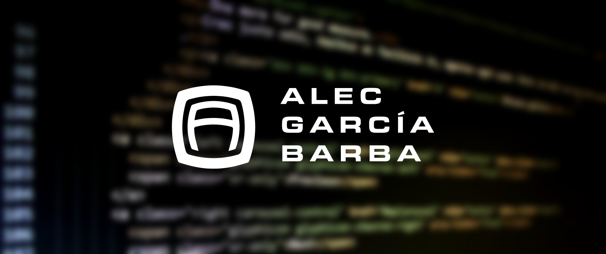

I'm a software developer with a Msc. in engineering sciences I work as a full stack engineer, and enjoy doing data-centered/ML projects. 

<h2> What I currently do</h2>

- 🔭 I'm working at ArkusNexus/Drata as a full stack engineer. 
- 👯 I’m looking to collaborate on Typescript / Nestjs related projects.
- 💬 Ask me about Node.js, React, or anything Data Science/ ML related!

<h2> Connect with me</h2>

 
 

## My Skill Set

<table><tr><td valign="top" width="33%">

### Frontend

   

 

  

</td><td valign="top" width="33%">

### Backend

    
  

  

 <!--PosgteSQL, GRAPHQL-->

 
 

</td><td valign="top" width="33%">

### Machine Learning

  
  
  
   

### DevOps

  
  
  
  
  
  

### Others

  
  

  
  

</td></tr></table>
 

<h2> Github Stats</h2> 

  

  

